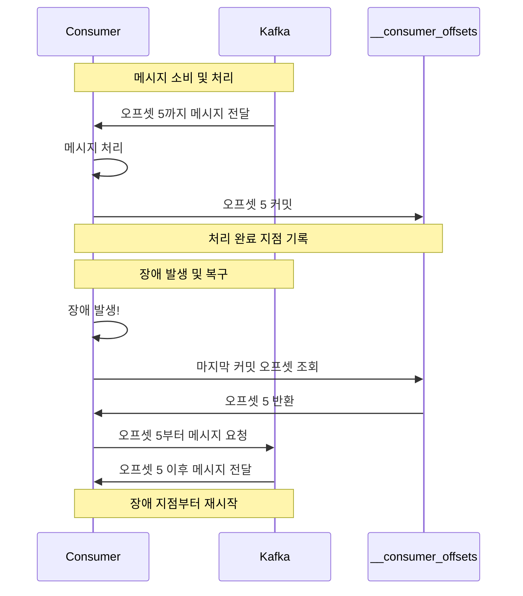
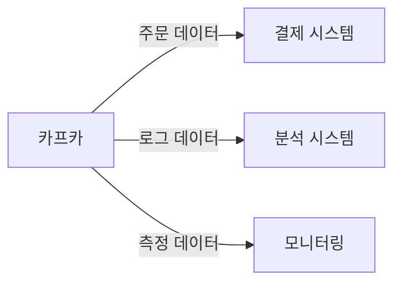
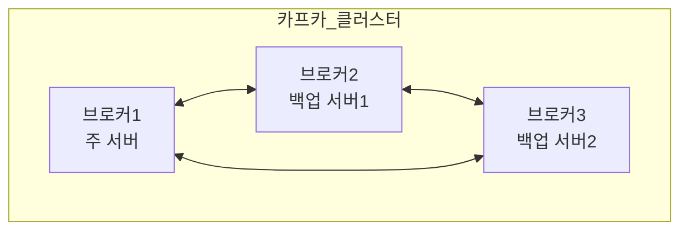
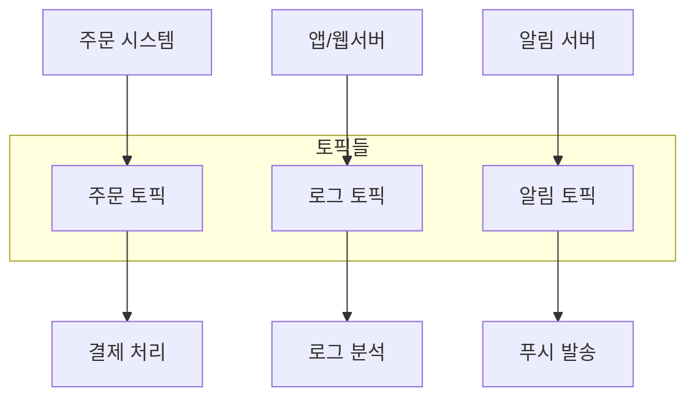
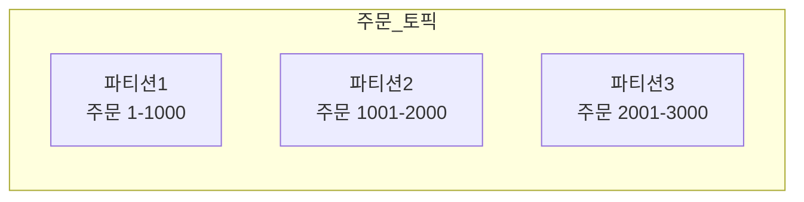
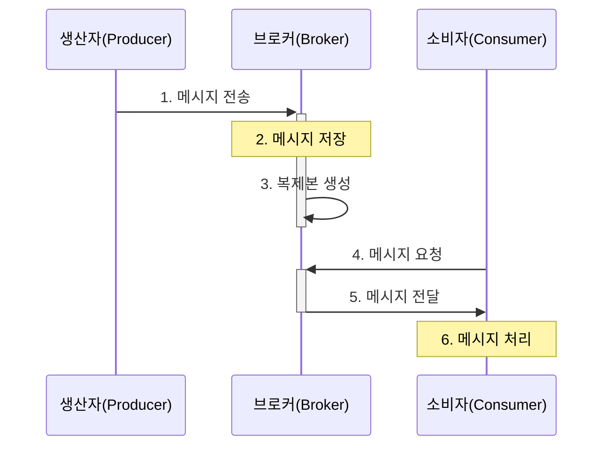
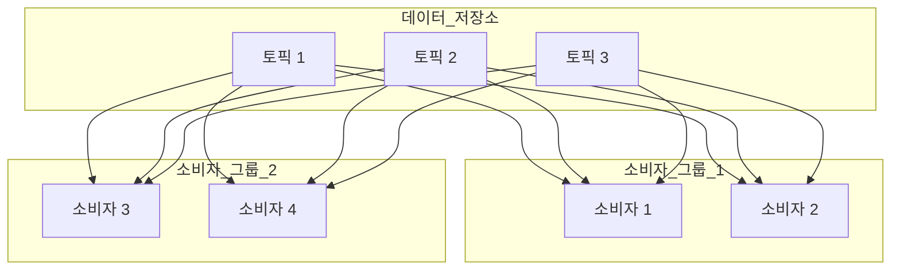
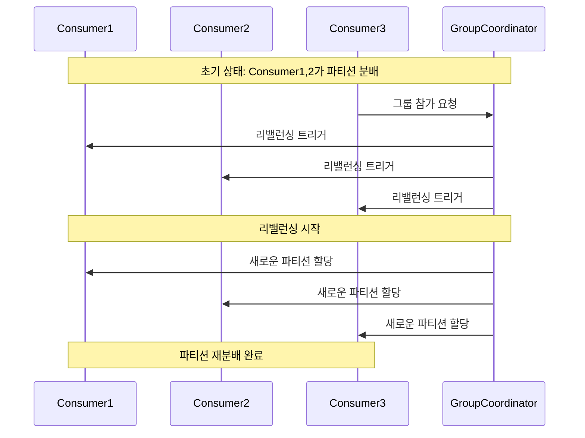

## 개요

- Apache Kafka는 실시간으로 대량의 데이터를 안전하게 전달하고 처리하기 위한 플랫폼임

### Kafka가 필요한 이유

- 우리가 사용하는 현대의 서비스들(넷플릭스, 쇼핑몰, SNS 등)은 수많은 데이터를 실시간으로 처리해야 함
    - 사용자의 클릭, 검색, 결제 데이터
    - 서비스 로그, 에러 메시지
    - IoT 센서 데이터
    - 실시간 알림

- 이러한 데이터를 안전하고 빠르게 처리하기 위해 Kafka를 사용함

## 기본 개념

### 메시지 전달 구성 요소
- 카프카를 우체국에 비유하면 다음과 같음

    ```mermaid
    graph LR
        A[편지 작성자<br>Producer] -->|편지 전송| B[우체국<br>Kafka Broker]
        B -->|편지 분류| C[우편함<br>Topic]
        C -->|편지 수령| D[수령인<br>Consumer]
    ```

- **Producer(생산자)**
  - 편지를 쓰는 사람
- **Kafka Broker(우체국)**
  - 메시지를 저장하고 전달하는 서버
- **Topic(우편함)**
  - 메시지를 종류별로 구분하는 공간
- **Consumer(소비자)**
  - 메시지를 받아서 처리하는 프로그램

### 메시지 추적과 관리
- **커밋**(**Commit**)이란?
  - 컨슈머가 어디까지 메시지를 처리했는지 표시하는 것
  - 마치 책갈피처럼 다음에 어디서부터 읽어야 할지 기억
  - 메시지 처리 진행 상황을 추적하고 관리

- **오프셋**(**Offset**)이란?
  - 각 파티션 내의 메시지 위치를 가리키는 번호
  - 첫 메시지는 0번부터 시작해서 순차적으로 증가
  - 메시지의 고유한 '주소'나 '페이지 번호' 같은 역할
  ```
  파티션
  [메시지0] [메시지1] [메시지2] [메시지3] ...
      ↑         ↑         ↑         ↑
  오프셋=0  오프셋=1  오프셋=2  오프셋=3
  ```

- **커밋과 오프셋의 관계**
  - 컨슈머는 처리한 메시지의 오프셋을 커밋
  - 커밋된 오프셋을 통해 처리 진행상황 파악
  - 장애 발생 시 마지막 커밋 오프셋부터 재시작



### 전체 아키텍처

- Kafka의 전체 구조를 이해하면 데이터가 어떻게 흐르는지 파악할 수 있음

    ```mermaid
    graph TB
        subgraph Producers[데이터 생산자들]
            P1[웹서버]
            P2[모바일앱]
            P3[IoT센서]
        end

        subgraph Kafka_Cluster[카프카 클러스터]
            subgraph Brokers[브로커들]
                B1[브로커1]
                B2[브로커2]
                B3[브로커3]
            end
            
            subgraph Topics[토픽들]
                T1[로그 토픽]
                T2[주문 토픽]
                T3[알림 토픽]
            end
        end

        subgraph Consumers[데이터 소비자들]
            C1[분석 시스템]
            C2[모니터링]
            C3[백업 시스템]
        end

        P1 & P2 & P3 --> Brokers
        Brokers <--> Topics
        Topics --> C1 & C2 & C3
    ```

### 주요 특징

- **안정성**
   - 데이터를 안전하게 보관 (마치 은행 금고처럼)
   - 여러 서버에 복사본 저장으로 데이터 유실 방지
   - 서버 장애가 발생해도 서비스 계속 운영

- **확장성**
   - 처리할 데이터가 늘어나면 서버 추가로 확장
   - 카카오톡 단체방처럼 많은 사용자 동시 처리 가능
   - 필요할 때마다 쉽게 용량 증설

- **고성능**
   - 대량의 데이터를 빠르게 처리
   - 효율적인 데이터 저장 방식 사용
   - 여러 소비자가 동시에 데이터 읽기 가능

### 메시지 생산자 (Producer)

- 데이터를 만들어서 Kafka로 보내는 프로그램

    ```mermaid
    graph LR
        A[웹서버] -->|주문 데이터| B[카프카]
        C[모바일앱] -->|로그 데이터| B
        D[센서] -->|측정 데이터| B
    ```

- ex)
    - 쇼핑몰의 주문 처리 시스템
    - 핸드폰 앱의 사용자 활동 로그
    - 기상 관측소의 온도 센서

### 메시지 소비자 (Consumer)

- Kafka에서 데이터를 가져와서 처리하는 프로그램



- ex)
    - 주문 데이터를 받아서 배송 처리하는 시스템
    - 사용자 행동 데이터를 분석하는 시스템
    - 실시간 알림을 보내는 서비스

### 메시지 저장소 (Broker)

- Kafka 서버를 브로커라고 부름
- 데이터를 저장하고 관리하는 창고와 같음



- 특징
    - 여러 서버가 협력하여 작동 (마치 여러 지점을 가진 은행처럼)
    - 한 서버가 고장나도 다른 서버가 대신 처리
    - 데이터를 안전하게 보관하고 전달

### 메시지 분류 (Topic)

- 토픽은 같은 종류의 메시지를 모아두는 공간임
- 도서관의 서가나 우체국의 우편함과 비슷함



- ex)
    - 주문 토픽: 모든 주문 관련 데이터 저장
    - 로그 토픽: 시스템 로그 메시지 저장
    - 알림 토픽: 사용자 알림 메시지 저장

### 데이터 분산 저장 (Partition)

- 각 토픽은 여러 개의 파티션으로 나뉘어 저장됨
- 하나의 큰 책을 여러 장으로 나누어 보관하는 것과 같음



- 장점
    - 대량의 데이터를 나눠서 처리 가능
    - 여러 소비자가 동시에 데이터 처리 가능
    - 데이터 처리 속도 향상

## 데이터 흐름

### 메시지가 전달되는 과정


- ex)
    1. 사용자가 온라인 쇼핑몰에서 주문 버튼 클릭
    2. 주문 시스템(Producer)이 주문 데이터를 Kafka로 전송
    3. Kafka가 주문 데이터를 '주문' 토픽에 안전하게 저장
    4. 결제 시스템(Consumer)이 새로운 주문 데이터를 가져감
    5. 배송 시스템(Consumer)이 동일한 주문 데이터로 배송 처리

### 데이터 처리 방식




- **병렬 처리**
    - 여러 소비자가 동시에 데이터 처리
    - 처리 속도 향상
    - 부하 분산

- **독립적 처리**
    - 각 소비자 그룹은 독립적으로 데이터 처리
    - 한 그룹의 문제가 다른 그룹에 영향을 주지 않음
    - 다양한 용도로 같은 데이터 사용 가능

- **순서 보장**
    - 같은 키를 가진 메시지는 순서대로 처리
    - ex)
        - 같은 사용자의 주문은 순서대로 처리
    - 다른 사용자의 주문은 병렬로 처리

## 활용 사례

### 로그 수집

- 실시간 로그 처리
  - 시스템/애플리케이션 로그 수집
    - 서버, 애플리케이션의 모든 로그를 중앙 집중화
  - 실시간 모니터링 데이터 처리
    - 시스템 성능, 사용자 행동 패턴 실시간 추적
  - 보안 이벤트 로그 분석
    - 보안 위협 실시간 탐지 및 대응
- 구현 고려사항
  - 로그 포맷 표준화
    - JSON 형식 등 일관된 로그 형식 정의
  - 보관 기간 설정
    - 법적 요구 사항, 디스크 용량을 고려한 보관 기간 설정
  - 처리 파이프라인 구성
    - 수집 → 필터링 → 저장 → 분석 단계별 처리

### 이벤트 스트리밍

- 실시간 데이터 처리
  - 실시간 분석
    - 사용자 행동, 시장 동향 등 실시간 분석
  - IoT 데이터 수집
    - 센서 데이터 실시간 수집 및 모니터링
  - 실시간 처리 파이프라인
    - 들어오는 데이터를 지연 없이 처리
- 주요 패턴
  - Event Sourcing
    - 상태 변경을 이벤트로 저장하여 이력 관리
  - CQRS
    - 읽기와 쓰기 작업을 분리하여 성능 최적화
  - Stream Processing
    - 데이터 흐름을 실시간으로 처리

### 데이터 동기화

- 시스템 간 데이터 연동
  - DB 변경 데이터 캡처(CDC)
    - 데이터베이스 변경사항 실시간 추적
  - 시스템 간 데이터 동기화
    - 여러 시스템의 데이터 일관성 유지
  - 캐시 업데이트
    - 캐시 데이터의 실시간 갱신으로 성능 향상
- 구현 패턴
  - Outbox Pattern
    - 분산 트랜잭션 문제 해결을 위한 이벤트 발행
  - Event-Driven Architecture
    - 이벤트 기반의 느슨한 결합 구조
  - Master-Slave Replication
    - 데이터베이스 복제 및 동기화

### 메시징 시스템

- 시스템 통합
  - 시스템 간 느슨한 결합
    - 서비스 간 직접 의존성 제거
  - 마이크로서비스 통신
    - 서비스 간 비동기 메시지 교환
  - 비동기 작업 처리
    - 시간이 오래 걸리는 작업의 비동기 처리
- 아키텍처 패턴
  - Pub/Sub Pattern
    - 발행자와 구독자 간의 메시지 전달
  - Point-to-Point
    - 1:1 메시지 전달 방식
  - Request-Reply
    - 요청-응답 기반의 메시지 교환

## 고급 기능

### 데이터 일관성과 안정성

- **메시지 전송 보장 수준 (acks)**
   - `acks=0`
     - 전송 즉시 성공으로 간주
     - 속도는 가장 빠르지만 데이터 유실 위험 높음
   - `acks=1`
     - 리더가 메시지 수신 확인 시 성공
     - 적절한 속도와 안정성의 균형
   - `acks=all`
     - 모든 복제본이 메시지 수신 확인 시 성공
     - 가장 안전하지만 속도는 느림

   ```java
   // 프로듀서 설정
   Properties props = new Properties();
   
   // 빠른 처리 속도 우선
   props.put("acks", "0");
   
   // 안정성과 속도의 균형
   props.put("acks", "1");
   
   // 데이터 안정성 우선
   props.put("acks", "all");
   
   KafkaProducer<String, String> producer = new KafkaProducer<>(props);
   ```

- **복제 설정**
   - `replication.factor`
     - 각 파티션의 복제본 수 지정
     - 높을수록 안전하지만 리소스 사용량 증가
     - 일반적으로 3 설정 (1 리더 + 2 팔로워)
   - `min.insync.replicas`
     - 최소 동기화 복제본 수
     - 이 수보다 적으면 쓰기 거부
     - 데이터 안정성 보장을 위한 중요 설정

   ```bash
   # 토픽 생성 시 복제 설정
   kafka-topics.sh --create \               # 토픽 생성 명령
     --bootstrap-server localhost:9092 \    # Kafka 브로커 주소
     --topic my-topic \                     # 생성할 토픽 이름
     --partitions 3 \                       # 파티션 수 (병렬 처리 단위)
     --replication-factor 3                 # 복제본 수 (데이터 안정성)

   # 브로커 설정 파일에서 최소 동기화 복제본 설정
   min.insync.replicas=2
   ```

- **데이터 정합성 보장**
   - ISR(In-Sync Replicas)
     - 리더와 제대로 동기화된 복제본들의 집합
     - `replica.lag.time.max.ms` 설정 시간 내에 리더와 동기화된 복제본만 포함
     - ISR이 아닌 복제본은 장애 복구 시 리더가 될 수 없음
   - 파티션 리더 선출
     - 리더 장애 시 ISR 중에서만 새 리더 선출
     - 가장 최신 데이터(높은 LEO)를 가진 복제본이 우선 선출
     - ISR 아닌 복제본은 데이터 유실 위험으로 리더가 될 수 없음
   - 커밋된 메시지 처리
     - High Watermark(HW)
        - 모든 ISR이 복제 완료한 최신 오프셋
     - 소비자는 HW까지의 메시지만 읽을 수 있음
     - 리더 변경 시에도 HW 이후 메시지는 롤백되어 데이터 일관성 유지
   
   ```mermaid
   graph LR
       A[리더] -->|복제| B[ISR 팔로워1]
       A -->|복제| C[ISR 팔로워2]
       A -->|복제 지연| D[비ISR 팔로워]
       
       subgraph 메시지_상태
           E[커밋된 메시지<br>HW까지]
           F[언커밋 메시지<br>HW 이후]
       end
   ```

## 운영 관리

### 성능 튜닝 설정

- **프로듀서 성능 설정**
   - `batch.size`
     - 한 번에 전송할 최대 메시지 크기
     - default value: 16384 바이트
     - 권장값: 64KB ~ 128KB (처리량 우선 시)
     - 영향도: 메모리 사용량 ↑, 처리량 ↑
     - 실제 사례: 로그 수집 시스템에서 128KB 사용 시 30% 처리량 향상
   
   - `linger.ms`
     - 배치를 전송하기 전 대기 시간
     - default value: 0ms (즉시 전송)
     - 권장값: 50ms ~ 100ms (처리량 우선 시)
     - 영향도: 지연시간 ↑, 처리량 ↑
     - 실제 사례: IoT 데이터 수집 시 100ms 설정으로 40% 네트워크 사용량 감소
   
   - `max.in.flight.requests.per.connection`
     - 응답을 기다리는 최대 요청 수
     - default value: 5
     - 권장값: 3 ~ 5 (메모리 제약 환경)
     - 영향도: 메모리 사용량 ↑, 동시성 ↑
     - 실제 사례: 고성능 환경에서 5로 설정 시 최적의 처리량 달성

   ```java
   // 프로듀서 성능 최적화 설정
   Properties props = new Properties();
   
   // 처리량 우선 설정
   props.put("batch.size", 262144);         // 256KB
   props.put("linger.ms", 100);             // 100ms
   props.put("compression.type", "snappy");  // 압축 활성화
   
   // 안정성 우선 설정
   props.put("max.in.flight.requests.per.connection", 3);
   props.put("retries", 3);
   props.put("acks", "all");
   
   KafkaProducer<String, String> producer = new KafkaProducer<>(props);
   ```

- **컨슈머 성능 설정**
   - `fetch.min.bytes`
     - 한 번에 가져올 최소 데이터 크기
     - default value: 1 바이트
     - 권장값: 1KB ~ 64KB (네트워크 효율성 우선 시)
     - 영향도: 지연시간 ↑, 네트워크 효율성 ↑
   
   - `max.poll.records`
     - 한 번에 가져올 최대 레코드 수
     - default value: 500
     - 권장값: 300 ~ 1000 (메모리 크기에 따라 조정)
     - 영향도: 메모리 사용량 ↑, 처리 지연 가능성 ↑
   
   - `heartbeat.interval.ms`
     - 그룹 코디네이터에 하트비트 전송 주기
     - default value: 3000ms
     - 권장값: session.timeout.ms의 1/3
     - 영향도: 네트워크 트래픽 ↑, 리밸런싱 감지 속도 ↑

   ```java
   // 컨슈머 성능 최적화 설정
   Properties props = new Properties();
   
   // 대용량 처리 설정
   props.put("fetch.min.bytes", 65536);      // 64KB
   props.put("max.poll.records", 500);
   props.put("fetch.max.bytes", 52428800);   // 50MB
   
   // 안정성 설정
   props.put("session.timeout.ms", 45000);   // 45초
   props.put("heartbeat.interval.ms", 15000); // 15초
   props.put("enable.auto.commit", "false");  // 수동 커밋
   
   KafkaConsumer<String, String> consumer = new KafkaConsumer<>(props);
   ```

- **브로커 성능 설정**
   - `num.io.threads`
     - 디스크 I/O 처리 스레드 수
     - default value: 8
     - 권장값: CPU 코어 수의 2배
     - 영향도: CPU 사용량 ↑, I/O 처리량 ↑
   
   - `num.network.threads`
     - 네트워크 요청 처리 스레드 수
     - default value: 3
     - 권장값: CPU 코어 수 * 2 (최소 8)
     - 영향도: CPU 사용량 ↑, 네트워크 처리량 ↑
   
   - `log.flush.interval.messages`
     - 디스크에 강제로 기록할 메시지 수
     - default value: 9223372036854775807
     - 권장값: 처리량에 따라 1000~50000
     - 영향도: 디스크 I/O ↑, 데이터 내구성 ↑

    ```properties
    # 브로커 서버 설정 파일 (server.properties)
    
    # 고성능 처리 설정
    num.io.threads=16                        # CPU 코어 수 * 2
    num.network.threads=16                   # network.threads와 동일 구성
    num.replica.fetchers=8                   # 복제 성능 향상
    
    # 메모리 최적화
    socket.receive.buffer.bytes=1048576      # 1MB
    socket.send.buffer.bytes=1048576         # 1MB
    replica.fetch.max.bytes=104857600        # 100MB
    
    # 디스크 I/O 최적화
    log.flush.interval.messages=10000
    log.flush.interval.ms=1000
    log.flush.scheduler.interval.ms=1000
    
    # 네트워크 최적화
    num.partitions=8                         # 브로커당 기본 파티션 수
    socket.request.max.bytes=104857600       # 100MB
    replica.fetch.response.max.bytes=10485760 # 10MB
    ```

### 확장성 관리

- **파티션 할당과 재조정**
   - 파티션 개수 결정 요소
     - 처리량 요구사항
        - 단일 파티션 처리량 = 100MB/s인 경우, 1GB/s 처리량 필요시 최소 10개 파티션 필요
     - 동시성 레벨
        - 컨슈머 그룹 내 병렬 처리를 위한 최대 컨슈머 수 결정
     - 메시지 순서
        - 동일 키의 메시지는 같은 파티션에 할당되어 순서 보장
   
   - 파티션 수 산정 공식
     ```
     필요 파티션 수 = MAX(
         처리량 기준: (예상 최대 처리량 * (1 + 성장률)) / (단일 파티션 처리량 * 0.7),
         컨슈머 기준: 목표 최대 컨슈머 수 * 2,
         보관 기준: (일일 데이터량 * 보관일수 * (1 + 성장률)) / (단일 파티션 최대 크기 * 0.7)
     )
     ```
     - 성장률
        - 예상 연간 데이터 증가율 (예: 0.3 = 30%)
     - 단일 파티션 처리량
        - 보통 10MB/s
     - 단일 파티션 최대 크기
        - 권장 25GB
     - 0.7
        - 안전율 (70% 활용도 기준)
   - 파티션 수 조정 시 고려사항
     - 파티션 수는 감소시킬 수 없음
     - 파티션당 최소 50MB/일 데이터량 권장
     - 브로커당 4000-6000개 파티션 제한
     - 파티션 수와 메모리 사용량은 비례
     - 단일 파티션 최대 크기는 리더 선출 시간에 영향을 미침

   - 파티션 확장 전략
     ```bash
     # 토픽의 파티션 수 증가
     kafka-topics.sh --bootstrap-server localhost:9092 \
                    --alter \
                    --topic my-topic \
                    --partitions 6

     # 파티션 재할당 계획 생성
     cat > reassign.json << EOF
     {
       "version": 1,
       "partitions": [
         {"topic": "my-topic", "partition": 0, "replicas": [0,1,2]},
         {"topic": "my-topic", "partition": 1, "replicas": [1,2,3]}
       ]
     }
     EOF

     # 파티션 재할당 실행
     kafka-reassign-partitions.sh --bootstrap-server localhost:9092 \
                                 --reassignment-json-file reassign.json \
                                 --execute
     ```

   - 리밸런싱 전략
     - RoundRobinAssignor (권장 기본 전략)
       ```java
       // 컨슈머 설정
       props.put("partition.assignment.strategy", 
                "org.apache.kafka.clients.consumer.RoundRobinAssignor");
       ```
       - 파티션을 컨슈머에 균등하게 분배
       - 더 나은 부하 분산 효과
       - 확장성이 우수함
     
     - Cooperative Rebalancing (점진적 리밸런싱)
       ```java
       // 컨슈머 설정
       props.put("partition.assignment.strategy", 
                "org.apache.kafka.clients.consumer.CooperativeStickyAssignor");
       ```
       - 리밸런싱 중에도 파티션 소비 가능
       - 서비스 중단 최소화
       - 대규모 클러스터에 적합
     
     - StickyAssignor (특수 케이스)
       ```java
       // 컨슈머 설정
       props.put("partition.assignment.strategy", 
                "org.apache.kafka.clients.consumer.StickyAssignor");
       ```
       - 리밸런싱 시 기존 할당 유지 최대화
       - 불필요한 파티션 재할당 최소화
       - 캐시 효율성 향상

     - 커스텀 할당 전략
       ```java
       // 사용자 정의 파티션 할당 전략
       public class CustomAssignor implements ConsumerPartitionAssignor {
           @Override
           public Map<String, List<TopicPartition>> assign(Map<String, Integer> partitionsPerTopic, 
                                                         Map<String, Subscription> subscriptions) {
               // 커스텀 로직 구현
           }

           @Override
           public void onAssignment(Assignment assignment, ConsumerGroupMetadata metadata) {
               // 할당 후 처리 로직
           }
       }
       ```



- **파티션 배치 전략**
   - 리더 파티션 분산
     ```properties
     # 브로커 설정 (server.properties)
     
     # 데이터 무손실을 위한 필수 설정
     min.insync.replicas=2                    # 최소 동기화 복제본 수
     unclean.leader.election.enable=false     # 데이터 일관성 우선
     
     # 자동 리더 재균형 설정
     auto.leader.rebalance.enable=true
     leader.imbalance.per.broker.percentage=20
     leader.imbalance.check.interval.seconds=300
     ```

   - 리플리케이션 배치
     ```properties
     # 랙 인식 배치 설정
     broker.rack=rack1  # 브로커1의 랙 정보
     
     # 복제본 배치 제한
     replica.selector.class=org.apache.kafka.common.replica.RackAwareReplicaSelector
     ```

   - 파티션 리더십 관리
     ```bash
     # 선호 리더 선출 실행
     kafka-leader-election.sh --bootstrap-server localhost:9092 \
                            --topic my-topic \
                            --partition 1 \
                            --election-type PREFERRED
     
     # 리더십 상태 확인
     kafka-topics.sh --bootstrap-server localhost:9092 \
                    --describe --topic my-topic
     ```
   
   - 고가용성을 위한 배치 규칙
     - 브로커 간 균등 분배
     - 랙 간 분산 배치 (단일 랙 장애 대비)
     - 리더/팔로워 역할 분산

- **스케일링 방안**
   - 수직적 확장 (Scale Up)
     - 하드웨어 리소스 증설
       ```properties
       # 메모리 설정
       # 브로커당 4GB가 표준적인 설정
       heap.opts=-Xms4g -Xmx4g  # JVM 힙 크기
       
       # GC 설정
       KAFKA_JVM_PERFORMANCE_OPTS="-server -XX:+UseG1GC -XX:MaxGCPauseMillis=20 -XX:InitiatingHeapOccupancyPercent=35 -XX:+ExplicitGCInvokesConcurrent -XX:G1HeapRegionSize=16M"
       
       # 디스크 설정
       log.dirs=/data/kafka-logs-1,/data/kafka-logs-2  # 다중 디스크 사용
       
       # 네트워크 설정
       socket.send.buffer.bytes=10485760    # 소켓 버퍼 크기 증가
       socket.receive.buffer.bytes=10485760
       ```

   - 수평적 확장 (Scale Out)
     ```bash
     # 새 브로커 추가를 위한 단계별 프로세스
     
     # 1. 새 브로커 설정
     broker.id=4
     zookeeper.connect=zk1:2181,zk2:2181,zk3:2181
     
     # 2. 파티션 재분배 계획 생성
     cat > expand-cluster-reassignment.json << EOF
     {
       "version": 1,
       "partitions": [
         {"topic": "my-topic", "partition": 0, "replicas": [1,2,4]},
         {"topic": "my-topic", "partition": 1, "replicas": [2,3,4]},
         {"topic": "my-topic", "partition": 2, "replicas": [3,4,1]}
       ]
     }
     EOF
     
     # 3. 재분배 실행 및 모니터링
     kafka-reassign-partitions.sh --bootstrap-server localhost:9092 \
                                 --reassignment-json-file expand-cluster-reassignment.json \
                                 --execute
     ```

   - 클러스터 조정 전략
     - 단계적 확장 프로세스
       1. 용량 계획 수립
          - 현재 사용량 분석 (CPU, 메모리, 디스크, 네트워크)
          - 예상 성장률 계산 (6-12개월)
          - 필요 리소스 산정 (N+2 여유도 확보)

       2. 브로커 확장 준비
          ```properties
          # 신규 브로커 설정 (server.properties)
          broker.id=4
          zookeeper.connect=zk1:2181,zk2:2181,zk3:2181
          log.dirs=/kafka/broker-4/logs
          listeners=PLAINTEXT://broker4:9092
          # 랙 인식 설정
          broker.rack=rack2
          ```

       3. 데이터 재분배 수행
          ```bash
          # 재분배 계획 생성
          cat > reassign.json << EOF
          {
            "version": 1,
            "partitions": [
              {"topic": "my-topic", "partition": 0, "replicas": [1,2,4]},
              {"topic": "my-topic", "partition": 1, "replicas": [2,3,4]},
              {"topic": "my-topic", "partition": 2, "replicas": [3,4,1]}
            ]
          }
          EOF
          
          # 재분배 실행 및 모니터링
          kafka-reassign-partitions.sh --bootstrap-server localhost:9092 \
                                      --reassignment-json-file reassign.json \
                                      --execute --throttle 50000000  # 50MB/s 제한

          # 재분배 진행 상태 확인
          kafka-reassign-partitions.sh --bootstrap-server localhost:9092 \
                                      --reassignment-json-file reassign.json \
                                      --verify
          ```

       4. 성능 모니터링
          - 브로커 레벨 메트릭
            - CPU 사용률 (임계치: 85%)
            - 메모리 사용률 (임계치: 80%)
            - 디스크 I/O (임계치: 80MB/s)
            - 네트워크 처리량 (임계치: 70%)
          
          - 토픽 레벨 메트릭
            - 메시지 처리량 (초당)
            - 복제 지연(Replica Lag)
            - ISR 크기 변화
            - 리더/팔로워 비율

     - 브로커 제거 절차
       1. 사전 준비
          - 제거할 브로커의 파티션 목록 확인
          - 데이터 마이그레이션 계획 수립
          - 리소스 여유도 검증
       
       2. 데이터 마이그레이션
          ```bash
          # 제거할 브로커의 파티션 이동 계획
          cat > remove-broker.json << EOF
          {
            "topics": [
              {"topic": "my-topic"}
            ],
            "version": 1
          }
          EOF
          
          # 파티션 재할당 계획 생성
          kafka-reassign-partitions.sh --bootstrap-server localhost:9092 \
                                      --generate \
                                      --topics-to-move-json-file remove-broker.json \
                                      --broker-list "1,2,3"
          ```
       
       3. 단계적 종료
          ```bash
          # 리더십 이전 (Preferred Replica Election)
          kafka-preferred-replica-election.sh --bootstrap-server localhost:9092
          
          # 브로커 상태 확인
          kafka-broker-api-versions.sh --bootstrap-server localhost:9092
          
          # 브로커 종료 전 마지막 점검
          kafka-topics.sh --bootstrap-server localhost:9092 --describe
          ```
     
     - 모니터링 및 경보 설정
       1. 핵심 메트릭
          - 브로커별 파티션 분포 (불균형 20% 이상 시 경보)
          - 리더/팔로워 비율 (리더 편중 30% 이상 시 경보)
          - 디스크 사용률 (임계치 85% 이상 시 경보)
          - 네트워크 처리량 (포화도 80% 이상 시 경보)
       
       2. 성능 메트릭
          - 메시지 처리 지연시간 (p99 > 100ms 시 경보)
          - 복제 지연 (Lag > 1000 시 경보)
          - Under-replicated 파티션 수 (0 초과 시 경보)
          - Active Controller 수 (1 아닐 시 경보)

### 메시지 압축

- **지원 알고리즘 비교**
   - gzip
     - 압축률: 매우 높음 (원본 대비 약 40% 크기)
     - CPU 사용량: 매우 높음 (4-5배)
     - 처리 속도: 가장 느림
     - 메모리 사용량: 높음
     - 장기 보관 데이터, 네트워크 대역폭 제약이 심한 환경
   - snappy
     - 압축률: 중간 (원본 대비 약 60% 크기)
     - CPU 사용량: 낮음 (1.5-2배)
     - 처리 속도: 빠름
     - 메모리 사용량: 낮음
     - 일반적인 메시징, 실시간 로그 수집
   - lz4
     - 압축률: 낮음 (원본 대비 약 70% 크기)
     - CPU 사용량: 매우 낮음 (1.2-1.5배)
     - 처리 속도: 매우 빠름
     - 메모리 사용량: 매우 낮음
     - 고성능 실시간 처리 필요한 경우
   - zstd
     - 압축률: 높음 (원본 대비 약 45% 크기)
     - CPU 사용량: 중간 (2-3배)
     - 처리 속도: 중간
     - 메모리 사용량: 중간
     - 압축률과 성능 균형이 필요한 경우

- **압축 설정**
   ```java
   // 프로듀서 압축 설정 예시
   Properties props = new Properties();
   
   // 메시지 압축 알고리즘 선택
   props.put("compression.type", "snappy");  // gzip, snappy, lz4, zstd
   
   // 압축 전 최소 메시지 크기 (바이트)
   // 이 크기보다 작은 메시지는 압축하지 않음
   props.put("compression.min.bytes", "1024");
   
   // zstd 압축 레벨 설정 (1-22, 기본값: 3)
   // 높을수록 압축률은 높아지지만 CPU 사용량 증가
   props.put("compression.level", "3");
   
   // 배치 크기를 증가시켜 압축 효율 향상
   props.put("batch.size", "131072");  // 128KB
   
   KafkaProducer<String, String> producer = new KafkaProducer<>(props);
   ```

- **브로커 압축 설정**
   ```properties
   # 브로커 압축 설정 (server.properties)
   
   # 로그 세그먼트 압축 정책
   log.compression.type=producer  # producer(기본값), uncompressed, lz4, snappy, gzip, zstd
   
   # 압축 관련 스레드 풀 크기
   compression.threads=4
   
   # 압축된 로그 세그먼트 최대 크기
   max.compressed.log.segment.bytes=536870912  # 512MB
   ```

- **성능 고려사항**
   - 네트워크 대역폭 영향
      - 압축으로 인한 전송 데이터 감소: 30-60%
      - 네트워크 비용 절감 효과
      - 대역폭 제한 환경에서 효과적
   
   - CPU 리소스 영향
      - 알고리즘별 CPU 사용량 차이
        - gzip: 높은 CPU 사용 (전체 CPU의 15-20%)
        - snappy: 중간 CPU 사용 (전체 CPU의 5-10%)
        - lz4: 낮은 CPU 사용 (전체 CPU의 3-7%)
      - 압축/해제 시 추가 CPU 사이클 필요
      - 서버 사양에 따른 알고리즘 선택 중요
   
   - 지연시간 영향
      - 압축 시 추가되는 지연시간
        - gzip: 1.5-2ms
        - snappy: 0.5-1ms
        - lz4: 0.3-0.5ms
      - 해제 시 추가되는 지연시간
        - gzip: 0.8-1ms
        - snappy: 0.2-0.4ms
        - lz4: 0.1-0.2ms
      
   - 메모리 사용량
      - 압축 버퍼로 인한 추가 메모리 사용
      - 알고리즘별 메모리 사용량 차이
      - 배치 크기에 따른 메모리 사용량 변화

### 메시지 보관

- **보관 정책 상세**
   - 시간 기반 정책
     ```properties
     # 토픽별 보관 기간 설정
     retention.ms=604800000        # 7일
     retention.ms=86400000         # 1일
     retention.ms=3600000          # 1시간
     ```
   
   - 크기 기반 정책
     ```properties
     # 토픽별 최대 크기 설정
     retention.bytes=1073741824    # 1GB
     retention.bytes=5368709120    # 5GB
     ```
   
   - 혼합 정책 예시
     ```properties
     # 두 조건 중 하나라도 충족 시 삭제
     retention.ms=604800000        # 7일
     retention.bytes=1073741824    # 1GB
     ```

- **정책 유형별 특징**
   - `Delete`
     - 오래된 메시지 완전 삭제
     - 디스크 공간 즉시 회수
     - 단순하고 예측 가능
   
   - `Compact`
     - 키별로 최신 메시지만 유지
     - 상태 기반 처리에 적합
     - 디스크 사용량 최적화
     ```properties
     # 압축 정책 설정
     cleanup.policy=compact
     
     # 압축 주기 설정 (밀리초)
     min.cleanable.dirty.ratio=0.5
     delete.retention.ms=86400000
     ```

- **고급 보관 설정**
   ```properties
   # 세그먼트 관리
   segment.bytes=1073741824        # 세그먼트 크기
   segment.ms=604800000           # 세그먼트 롤링 주기
   
   # 인덱스 관리
   segment.index.bytes=10485760   # 인덱스 크기
   
   # 정리 스케줄링
   log.cleanup.interval.ms=300000  # 정리 검사 주기
   ```


### 모니터링 지표

- **브로커 핵심 메트릭**
   - 복제 관련
     - `UnderReplicatedPartitions`: 복제 지연 파티션 수
     - `IsrShrinksPerSec`: ISR 축소 빈도
     - `IsrExpandsPerSec`: ISR 확장 빈도
     - `ReplicationBytesInPerSec`: 복제 수신 바이트
   
   - 요청 처리
     - `RequestQueueSize`: 요청 대기열 크기
     - `RequestHandlerAvgIdlePercent`: 핸들러 유휴율
     - `NetworkProcessorAvgIdlePercent`: 네트워크 처리 유휴율
   
   - 디스크 성능
     - `LogFlushRateAndTimeMs`: 로그 플러시 지연시간
     - `LogFlushPerSec`: 초당 로그 플러시 횟수
     - ``PageCacheHitRatio``: 페이지 캐시 적중률
     - LogDirsDiskUsagePercent: 로그 디렉토리 디스크 사용률

- **프로듀서 성능 메트릭**
   - 처리량
     - `RecordSendRate`: 초당 전송 레코드 수
     - `BytesSentPerSec`: 초당 전송 바이트
     - `CompressionRateAvg`: 평균 압축률
   
   - 지연시간
     - `RequestLatencyAvg`: 평균 요청 지연시간
     - `RequestLatencyMax`: 최대 요청 지연시간
     - `RecordQueueTimeAvg`: 평균 대기열 시간
   
   - 배치 처리
     - `BatchSizeAvg`: 평균 배치 크기
     - `RecordPerRequestAvg`: 요청당 평균 레코드 수
     - `RecordRetries`: 재시도 횟수

- **컨슈머 성능 메트릭**
   - 처리량
     - `RecordsConsumedRate`: 초당 소비 레코드 수
     - `BytesConsumedRate`: 초당 소비 바이트
     - `FetchRequestRate`: 초당 fetch 요청 수
   
   - 지연
     - ConsumerLag: 컨슈머 지연(파티션별)
     - ConsumerLagByGroup: 그룹별 컨슈머 지연
     - FetchLatencyAvg: 평균 fetch 지연시간
   
   - 처리 성능
     - RecordsProcessedPerSec: 초당 처리 레코드 수
     - ProcessingTimeAvg: 평균 처리 시간
     - CommitLatencyAvg: 평균 커밋 지연시간

- **JVM 및 시스템 메트릭**
   - JVM 상태
     - `G1YoungGenerationTime`: G1 Young GC 시간
     - `G1OldGenerationTime`: G1 Old GC 시간
     - `HeapMemoryUsage`: 힙 메모리 사용량
     - `NonHeapMemoryUsage`: 비힙 메모리 사용량
   
   - 시스템 자원
     - `CPUUtilization`: CPU 사용률
     - `NetworkInboundRate`: 네트워크 수신률
     - `NetworkOutboundRate`: 네트워크 송신률
     - `DiskUtilization`: 디스크 사용률

- **알림 설정 권장값**
   ```properties
   # 브로커 알림 임계값
   under_replicated_partitions.threshold=0
   request_queue_size.threshold=100
   page_cache_hit_ratio.min=0.8
   log_flush_latency.max=500

   # 컨슈머 알림 임계값
   consumer_lag.max=10000
   consumer_lag_minutes.max=30
   fetch_latency.max=1000

   # 시스템 알림 임계값
   cpu_utilization.max=0.85
   heap_memory_usage.max=0.8
   disk_usage.max=0.85
   gc_time.max=100
   ```

### 커밋과 오프셋 관리

- **커밋 로그**
   - 커밋의 의미
     - 컨슈머가 메시지를 성공적으로 처리했음을 기록
     - 장애 발생 시 재시작 지점으로 사용
     - 컨슈머 그룹의 진행 상황 추적
   - 커밋 로그 저장
     - `__consumer_offsets` 토픽에 저장
     - 컨슈머 그룹별로 관리
     - 주기적으로 압축되어 용량 관리

- **오프셋 관리 전략**
   - 자동 커밋
     - `enable.auto.commit=true`로 설정
     - `auto.commit.interval.ms` 간격으로 자동 커밋
     - 간단하지만 중복/유실 가능성 있음
   - 수동 커밋
     - `commitSync()`: 동기식 커밋
       - 안전하지만 성능 저하 가능성
     - `commitAsync()`: 비동기식 커밋
       - 성능은 좋지만 실패 시 재시도 없음

   ```java
   // 자동 커밋 설정
   Properties autoCommitProps = new Properties();
   autoCommitProps.put("enable.auto.commit", "true");
   autoCommitProps.put("auto.commit.interval.ms", "5000");
   
   // 수동 커밋 예시
   Properties manualCommitProps = new Properties();
   manualCommitProps.put("enable.auto.commit", "false");
   KafkaConsumer<String, String> consumer = new KafkaConsumer<>(manualCommitProps);
   
   // 동기식 커밋
   try {
       ConsumerRecords<String, String> records = consumer.poll(Duration.ofMillis(100));
       processRecords(records); // 레코드 처리
       consumer.commitSync(); // 동기식 커밋
   } catch (Exception e) {
       // 에러 처리
   }
   
   // 비동기식 커밋
   consumer.commitAsync((offsets, exception) -> {
       if (exception != null) {
           System.err.println("Commit failed for offsets: " + offsets);
       }
   });
   ```
   - 커밋 정책
     - `at-most-once`: 메시지 유실 가능성
     - `at-least-once`: 중복 처리 가능성
     - `exactly-once`: 정확히 한 번 처리 보장

- **오프셋 리셋**
   - `auto.offset.reset` 설정
     - `earliest`: 가장 오래된 오프셋부터 시작
     - `latest`: 최신 오프셋부터 시작
     - `none`: 저장된 오프셋이 없으면 에러
   - 수동 리셋
     - 특정 시점으로 오프셋 이동
     - 데이터 재처리 필요 시 사용
     - 신중한 사용 필요


## Reference

- [Apache Kafka 공식 문서](https://kafka.apache.org/documentation/)
- [Kafka 디자인 문서](https://kafka.apache.org/documentation/#design)
- [Kafka 프로토콜 가이드](https://kafka.apache.org/protocol.html)