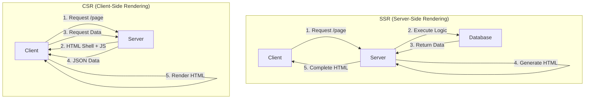

# 웹 애플리케이션 이해

- 김영한님의 스프링 MVC 1편 백엔드 웹 개발 핵심 기술 강의를 통해 웹 애플리케이션의 구조와 핵심 기술을 정리함

  

## 웹 애플리케이션의 기본 구조

### 웹 서버와 WAS

- 현대 웹 애플리케이션은 HTTP 프로토콜을 기반으로 동작하며, 정적 리소스 처리와 동적 로직 실행을 분리하여 처리함

- **웹 서버 (Web Server)**
  - 역할
    - 정적 리소스(HTML, CSS, JS, 이미지) 제공
  - 예시
    - NGINX, Apache
  - 특징
    - 안정적이고 장애에 강함
- **WAS (Web Application Server)**
  - 역할
    - 애플리케이션 로직 실행 + 정적 리소스 제공
  - 예시
    - Tomcat, Jetty, Undertow
  - 특징
    - 서블릿 컨테이너를 통한 동적 처리

### 최적 시스템 아키텍처

- **계층 분리의 이점**
  - **효율적 리소스 관리**
    - 부하에 따라 Web Server 또는 WAS를 독립적으로 확장
  - **장애 격리**
    - WAS 장애 시에도 Web Server가 오류 페이지 제공
  - **성능 최적화**
    - 정적 리소스는 Web Server가 빠르게 처리, 애플리케이션 로직은 WAS에서 전담

  

## 서블릿(Servlet) 아키텍처

### 서블릿의 핵심 개념

- 서블릿은 개발자가 비즈니스 로직에만 집중할 수 있도록 HTTP 통신의 복잡성을 추상화함

- **서블릿이 해결하는 문제**
  - TCP/IP 연결, 소켓 관리
  - HTTP 메시지 파싱
  - HTTP 응답 메시지 생성
  - **개발자는 비즈니스 로직에만 집중**

### 서블릿 생명주기

- **서블릿 컨테이너의 특징**
  - **싱글톤 관리**
    - 서블릿 객체를 한 번만 생성하고 재사용
  - **멀티스레드 지원**
    - 동시 요청을 여러 스레드로 처리
  - **생명주기 관리**
    - 생성, 초기화, 호출, 종료를 자동 관리

  

## 멀티스레드 처리 전략

### 스레드 풀(Thread Pool) 아키텍처

- **스레드 풀 동작 방식**
  - **사전 생성**
    - 애플리케이션 시작 시 스레드를 미리 생성
  - **재사용**
    - 요청 처리 후 스레드를 풀에 반납
  - **제한**
    - 최대 스레드 수를 초과하면 대기 또는 거절

### 스레드 풀 튜닝 전략

- **튜닝 가이드라인**
  - **테스트 기반 설정**
    - Apache AB, JMeter, nGrinder로 성능 테스트
  - **모니터링 지표**
    - CPU 사용률, 메모리 사용률, 응답 시간
  - **클라우드 환경**
    - 장애 시 서버 증설 후 점진적 튜닝

  

## 렌더링 전략

### SSR와 CSR 비교

| 구분 | SSR | CSR |
|------|-----|-----|
| **HTML 생성 위치** | 서버 | 클라이언트 (브라우저) |
| **초기 로딩 속도** | 빠름 | 느림 |
| **페이지 전환** | 느림 (전체 새로고침) | 빠름 (부분 업데이트) |
| **SEO** | 유리 | 불리 (개선 가능) |
| **서버 부하** | 높음 | 낮음 |
| **기술 스택** | JSP, Thymeleaf | React, Vue.js |
| **적합한 사용 사례** | 정적 콘텐츠, 관리자 페이지 | 대시보드, SPA, 인터랙티브 UI |

### HTTP API 패턴

 WAS
    WAS --> DB
    DB --> WAS
    WAS --> API
    API -->||

- **HTTP API 활용**
  - 웹 클라이언트와 서버 (AJAX, Fetch API)
  - 모바일 앱과 서버
  - 서버와 서버 (마이크로서비스 간 통신)

  

## Spring 웹 기술 발전사

### 기술 진화 타임라인

### 현대 Spring 스택

- **기술 선택 가이드**
  - **Spring MVC**
    - 대부분의 일반적인 웹 애플리케이션 (99%)
  - **Spring WebFlux**
    - 대용량 스트리밍, 실시간 데이터 처리 (1%)
  - **Thymeleaf**
    - 서버 사이드 렌더링 필요 시
  - **REST API + SPA**
    - 복잡한 UI, 모바일 앱 연동

  

## 연습 문제

1. 웹 서버 vs WAS, 핵심 차이는 무엇일까요?

   a. 동적 콘텐츠 처리

   - 웹 서버는 미리 준비된 정적 파일을 제공하고, WAS는 프로그램 코드를 실행하여 요청에 따라 다른 동적 콘텐츠를 생성하는 역할을 주로 담당함

2. 서블릿이 등장하며 개발자를 어떻게 도왔나요?

   a. HTTP 요청/응답 처리 자동화

   - 서블릿은 HTTP 요청 메시지를 파싱하고 응답 메시지를 만드는 등 반복적인 저수준 작업을 자동화하여 개발자가 핵심 비즈니스 로직에 집중할 수 있게 함

3. WAS에서 스레드 풀을 사용하는 주된 이유는 무엇일까요?

   a. 스레드 생성/관리 효율화

   - 요청마다 스레드를 새로 만드는 대신, 미리 일정 개수의 스레드를 만들어두고 재활용함
   - 이는 스레드 생성 비용을 줄이고 동시 요청을 효율적으로 처리하며 서버 부하를 관리하는 데 도움이 됨

4. 서버가 데이터와 템플릿을 조합해 최종 HTML 문서를 만들어 웹 브라우저로 보내는 방식을 무엇이라고 부를까요?

   a. 서버 측 렌더링 (SSR)

   - 서버 측 렌더링(SSR)은 서버에서 필요한 데이터를 가져와 HTML 템플릿에 적용하여 완성된 HTML을 클라이언트에 전달하는 방식임
   - 클라이언트는 받은 HTML을 바로 표시함

5. 웹 서버와 WAS를 함께 사용하는 일반적인 시스템 구성의 장점은 무엇일까요?

   a. WAS 핵심 로직 집중

   - 웹 서버가 정적 자원 처리를 전담하면, WAS는 무거운 동적 콘텐츠 생성이나 비즈니스 로직 처리에만 집중할 수 있게 되어 효율성이 높아지고 안정적으로 서비스를 제공할 수 있음

  

## 요약 정리

- **아키텍처 원칙**
  - **계층 분리**
    - Web Server (정적) - WAS (동적) - Database
  - **싱글톤 관리**
    - 서블릿과 Spring Bean은 재사용
  - **멀티스레드**
    - WAS가 자동 처리, 개발자는 비즈니스 로직 집중
  - **적절한 렌더링**
    - SSR (정적 페이지) vs CSR (동적 UI)
- **주의사항**
  - **공유 변수 사용 금지**
    - 서블릿과 Spring Bean은 싱글톤이므로 인스턴스 필드에 상태를 저장하면 동시성 문제 발생
  - **스레드 풀 튜닝**
    - 실제 부하 테스트를 통해 최적값 도출
  - **기술 선택**
    - 요구사항에 맞는 렌더링 전략 선택 (무조건 CSR이 좋은 것은 아님)

  

## Reference

- [스프링 MVC 1편 - 백엔드 웹 개발 핵심 기술](https://www.inflearn.com/course/%EC%8A%A4%ED%94%84%EB%A7%81-mvc-1)
