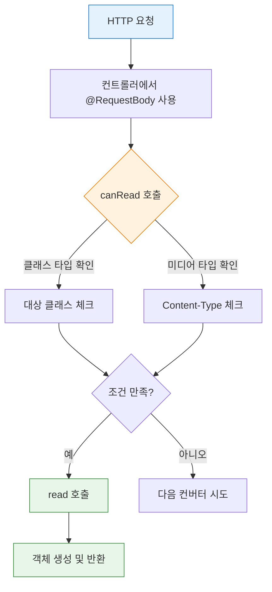
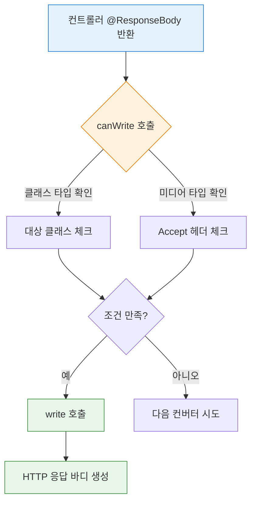

# 스프링 MVC 기본 기능

- 김영한님의 스프링 MVC 1편 강의를 통해 스프링 MVC의 기본 기능들인 로깅, 요청 매핑, 요청 데이터 처리, 응답 데이터 생성, HTTP 메시지 컨버터의 동작 원리를 정리함

<br/><br/>

## 프로젝트 기본 설정

### 프로젝트 생성

- **빌드 도구**
  - Gradle
- **언어**
  - Java 11
- **Spring Boot**
  - 2.4.x
- **패키징**
  - Jar (내장 톰캣 사용)
- **Dependencies**
  - Spring Web
  - Thymeleaf
  - Lombok

### Jar와 War 비교

- **Jar (Java Archive)**
  - **정의**
    - 애플리케이션과 내장 WAS(톰캣)를 함께 패키징
  - **실행 방식**
    - `java -jar application.jar`
    - 별도의 WAS 설치 불필요
  - **특징**
    - 독립 실행 가능한 애플리케이션
    - 내장 톰캣이 포함되어 있음
    - 개발과 운영 환경 차이 최소화
- **War (Web Application Archive)**
  - **정의**
    - 웹 애플리케이션만 패키징 (WAS 미포함)
  - **실행 방식**
    - 외부 톰캣/제티 등의 WAS에 배포 필요
  - **특징**
    - WAS에 종속적
    - 전통적인 자바 웹 애플리케이션 방식
    - `WEB-INF`, `web.xml` 등 표준 디렉토리 구조

<br/><br/>

## 로깅

### 로깅 라이브러리

- 스프링 부트는 기본으로 다음 로깅 라이브러리를 사용
  - **SLF4J** (인터페이스)
  - **Logback** (구현체)

### 로그 레벨

```
TRACE > DEBUG > INFO > WARN > ERROR
```

- 개발 서버
  - `DEBUG` 레벨 출력
- 운영 서버
  - `INFO` 레벨 출력

### 로그 설정

```properties
# 전체 로그 레벨 설정 (기본: INFO)
logging.level.root=info

# 패키지별 로그 레벨 설정
logging.level.hello.springmvc=debug
```

### 로그 사용법

```java
@Slf4j
@RestController
public class LogTestController {
    @RequestMapping("/log-test")
    public String logTest() {
        String name = "Spring";
        
        // 로그 레벨별 출력
        log.trace("trace log={}", name);
        log.debug("debug log={}", name);
        log.info("info log={}", name);
        log.warn("warn log={}", name);
        log.error("error log={}", name);
        
        return "ok";
    }
}
```

- [로그 테스트 컨트롤러 전체 코드](https://github.com/mxxikr/spring-mvc-part1/blob/master/springmvc/src/main/java/hello/springmvc/basic/LogTestController.java)

### 올바른 로그 사용법

- **올바른 방법**

  ```java
  log.info("message={}", data);
  ```

  - 파라미터 방식 사용
  - 로그 레벨에 따라 해당 로그가 출력되지 않으면 문자열 연산이 발생하지 않음

- **잘못된 방법**

  ```java
  log.info("message=" + data);
  ```

  - 문자열 연결 연산이 항상 발생함
  - 로그가 출력되지 않아도 불필요한 연산 수행
  - 성능 저하

### 로깅의 장점

- **쓰레드 정보, 클래스 이름과 같은 부가 정보 제공**
  - 출력 형식 통일
- **로그 레벨에 따라 출력 조절 가능**
  - 개발/운영 서버별 차등 적용
- **콘솔뿐만 아니라 파일, 네트워크 등 위치를 지정할 수 있음**
  - 일별로 파일 분할 가능
- **성능이 `System.out`보다 우수**
  - 내부 버퍼링, 멀티 쓰레드 등 최적화

<br/><br/>

## 요청 매핑

### 기본 매핑

```java
@RestController
public class MappingController {
    @RequestMapping("/hello-basic")  // 모든 HTTP 메서드 허용
    @GetMapping("/mapping-get")      // GET 메서드만 허용
}
```

- **`@RestController`**
  - `@Controller` + `@ResponseBody`
  - 반환 값을 HTTP 메시지 바디에 직접 입력

- [기본 매핑 전체 코드](https://github.com/mxxikr/spring-mvc-part1/blob/master/springmvc/src/main/java/hello/springmvc/basic/requestmapping/MappingController.java)

### HTTP 메서드 매핑

```java
@GetMapping      // GET
@PostMapping     // POST
@PutMapping      // PUT
@DeleteMapping   // DELETE
@PatchMapping    // PATCH
```

- 메서드가 일치하지 않으면 405 상태코드 반환

### PathVariable (경로 변수)

```java
@GetMapping("/mapping/{userId}")
public String mappingPath(@PathVariable String userId) {
    return "ok";
}

// 다중 PathVariable 사용
@GetMapping("/mapping/users/{userId}/orders/{orderId}")
public String mappingPath(
        @PathVariable String userId,
        @PathVariable Long orderId) {
    return "ok";
}
```

- **경로 변수**
  - URL 경로에 값을 포함시켜 전달
  - RESTful API 설계에 적합
  - 변수명이 같으면 `@PathVariable("userId")` 생략 가능

### 조건부 매핑

- **특정 파라미터 조건**

  ```java
  @GetMapping(value = "/mapping-param", params = "mode=debug")
  public String mappingParam() {
      return "ok";
  }
  ```

- **특정 헤더 조건**

  ```java
  @GetMapping(value = "/mapping-header", headers = "mode=debug")
  public String mappingHeader() {
      return "ok";
  }
  ```

- **Content-Type 조건**

  ```java
  @PostMapping(value = "/mapping-consume", consumes = "application/json")
  public String mappingConsumes() {
      return "ok";
  }
  ```

- **Accept 조건**

  ```java
  @PostMapping(value = "/mapping-produce", produces = "text/html")
  public String mappingProduces() {
      return "ok";
  }
  ```

### RESTful API 예시

```java
@RestController
@RequestMapping("/mapping/users")
public class MappingClassController {
    @GetMapping            // 회원 목록 조회
    @PostMapping           // 회원 등록
    @GetMapping("/{userId}")  // 회원 조회
    @PatchMapping("/{userId}") // 회원 수정
    @DeleteMapping("/{userId}") // 회원 삭제
}
```

- [RESTful API 매핑 전체 코드](https://github.com/mxxikr/spring-mvc-part1/blob/master/springmvc/src/main/java/hello/springmvc/basic/requestmapping/MappingClassController.java)

<br/><br/>

## HTTP 요청 데이터 처리

### 요청 데이터 전달 방식


- **GET - 쿼리 파라미터**
  - `/url?username=hello&age=20`
  - 메시지 바디 없이 URL의 쿼리 파라미터에 데이터 포함
  - 검색, 필터, 페이징 등에서 사용
- **POST - HTML Form**
  - `Content-Type: application/x-www-form-urlencoded`
  - 메시지 바디에 쿼리 파라미터 형식으로 전달
  - 회원 가입, 상품 주문 등에서 사용
- **HTTP message body**
  - HTTP API에서 주로 사용
  - JSON, XML, TEXT
  - POST, PUT, PATCH

### `@RequestParam`

- **기본 사용**

  ```java
  // 파라미터 이름 지정
  @RequestMapping("/request-param-v1")
  public String requestParamV1(
          @RequestParam("username") String memberName,
          @RequestParam("age") int memberAge) {
      log.info("username={}, age={}", memberName, memberAge);
      return "ok";
  }
  ```

- **파라미터 이름 생략**

  ```java
  // 변수명과 파라미터명이 같으면 생략 가능
  @RequestMapping("/request-param-v2")
  public String requestParamV2(
          @RequestParam String username,
          @RequestParam int age) {
      return "ok";
  }
  ```

- **애노테이션 생략**

  ```java
  // 단순 타입은 @RequestParam 생략 가능
  @RequestMapping("/request-param-v3")
  public String requestParamV3(String username, int age) {
      return "ok";
  }
  ```

  - 단순 타입인 경우 생략 가능
  - 너무 생략하면 명확하지 않으므로 `@RequestParam` 사용 권장

- **필수 파라미터 설정**

  ```java
  // required 옵션으로 필수 여부 설정
  @RequestMapping("/request-param-required")
  public String requestParamRequired(
          @RequestParam(required = true) String username,
          @RequestParam(required = false) Integer age) {
      return "ok";
  }
  ```

  - `required = true`
    - 기본값, 파라미터 필수
  - `required = false`
    - 파라미터 선택
  - 주의
    - `int age`는 `null`을 받을 수 없으므로 `Integer age` 사용

- **기본값 설정**

  ```java
  // defaultValue로 기본값 지정
  @RequestMapping("/request-param-default")
  public String requestParamDefault(
          @RequestParam(defaultValue = "guest") String username,
          @RequestParam(defaultValue = "-1") int age) {
      return "ok";
  }
  ```

  - `defaultValue`는 빈 문자열("")에도 적용됨

- **Map으로 조회**

  ```java
  // 모든 파라미터를 Map으로 받기
  @RequestMapping("/request-param-map")
  public String requestParamMap(@RequestParam Map<String, Object> paramMap) {
      log.info("username={}, age={}", 
          paramMap.get("username"), paramMap.get("age"));
      return "ok";
  }
  ```

### `@ModelAttribute`

- **객체 자동 바인딩**

  ```java
  @Data
  public class HelloData {
      private String username;
      private int age;
  }
  
  // 요청 파라미터를 객체로 자동 바인딩
  @RequestMapping("/model-attribute-v1")
  public String modelAttributeV1(@ModelAttribute HelloData helloData) {
      log.info("username={}, age={}", helloData.getUsername(), helloData.getAge());
      return "ok";
  }
  ```

- [HelloData 클래스 코드](https://github.com/mxxikr/spring-mvc-part1/blob/master/springmvc/src/main/java/hello/springmvc/basic/HelloData.java)
- [요청 파라미터 처리 전체 코드](https://github.com/mxxikr/spring-mvc-part1/blob/master/springmvc/src/main/java/hello/springmvc/basic/request/RequestParamController.java)

- **동작 과정**
  1. `HelloData` 객체 생성
  2. 요청 파라미터 이름으로 `HelloData` 객체의 프로퍼티 찾기
  3. 해당 프로퍼티의 setter 호출하여 값 바인딩

- **애노테이션 생략**

  ```java
  // 단순 타입 외의 객체는 @ModelAttribute 생략 가능
  @RequestMapping("/model-attribute-v2")
  public String modelAttributeV2(HelloData helloData) {
      return "ok";
  }
  ```

  - 단순 타입 외의 객체는 `@ModelAttribute` 생략 가능

- **바인딩 규칙**
  - `String`, `int`, `Integer` 등 단순 타입
    - `@RequestParam` 적용
  - 나머지
    - `@ModelAttribute` 적용

### HTTP 메시지 바디 - 단순 텍스트

- **`@RequestBody` (권장)**

  ```java
  // @RequestBody로 HTTP 메시지 바디 직접 조회
  @PostMapping("/request-body-string-v3")
  public HttpEntity<String> requestBodyStringV3(@RequestBody String messageBody) {
      log.info("messageBody={}", messageBody);
      return new HttpEntity<>("ok");
  }
  ```

- HTTP 메시지 바디 정보를 편리하게 조회

- [HTTP 메시지 바디 처리 전체 코드](https://github.com/mxxikr/spring-mvc-part1/blob/master/springmvc/src/main/java/hello/springmvc/basic/request/RequestBodyStringController.java)

### HTTP 메시지 바디 - JSON

- **자동 변환 (권장)**

  ```java
  // HTTP 메시지 컨버터가 JSON을 객체로 자동 변환
  @ResponseBody
  @PostMapping("/request-body-json-v2")
  public String requestBodyJsonV2(@RequestBody HelloData data) {
      log.info("username={}, age={}", data.getUsername(), data.getAge());
      return "ok";
  }
  ```

- **동작 방식**
  - `@RequestBody`에 직접 객체 지정
  - HTTP 메시지 컨버터가 JSON을 객체로 변환
  - `Content-Type: application/json` 필수
- **장점**
  - 수동 변환 불필요 (`ObjectMapper` 사용 X)
  - 간결한 코드
  - HTTP API 개발에 필수

- [JSON 처리 전체 코드](https://github.com/mxxikr/spring-mvc-part1/blob/master/springmvc/src/main/java/hello/springmvc/basic/request/RequestBodyJsonController.java)

> **주의**
> 
> - `@RequestBody`는 생략 불가능
> - 생략하면 `@ModelAttribute`가 적용되어 요청 파라미터를 처리하게 됨

<br/><br/>

## HTTP 응답 데이터 생성

### 응답 데이터 생성 방식

- **정적 리소스**
  - 웹 브라우저에 정적인 HTML, CSS, JS 제공
- **뷰 템플릿**
  - 동적인 HTML 제공
- **HTTP 메시지**
  - HTTP 메시지 바디에 JSON 같은 데이터 직접 전달

### 정적 리소스

- **경로**
  - `src/main/resources/static`
  - `src/main/resources/public`
  - `src/main/resources/resources`
  - `src/main/resources/META-INF/resources`
- **URL 매핑**
  - `src/main/resources/static/basic/hello.html` → `http://localhost:8080/basic/hello.html`
- **사용**
  - HTML, CSS, JavaScript 파일
  - 이미지, 폰트 등의 리소스
  - 변하지 않는 고정된 콘텐츠

### 뷰 템플릿

- **경로**
  - `src/main/resources/templates`

- **ModelAndView 반환**

  ```java
  // ModelAndView 객체로 모델과 뷰 이름 전달
  @RequestMapping("/response-view-v1")
  public ModelAndView responseViewV1() {
      ModelAndView mav = new ModelAndView("response/hello").addObject("data", "hello!");
      return mav;
  }
  ```

- **String 반환 (논리 뷰 이름)**

  ```java
  // 뷰 논리 이름을 String으로 반환
  @RequestMapping("/response-view-v2")
  public String responseViewV2(Model model) {
      model.addAttribute("data", "hello!");
      return "response/hello";
  }
  ```

- **사용**
  - 동적으로 변하는 HTML 페이지
  - 사용자별 맞춤 콘텐츠
  - 서버 사이드 렌더링 (SSR)

### HTTP API 응답

- **`@ResponseBody` (권장)**

  ```java
  // @ResponseBody로 HTTP 메시지 바디에 직접 JSON 데이터 반환
  @ResponseStatus(HttpStatus.OK)
  @ResponseBody
  @GetMapping("/response-body-json-v2")
  public HelloData responseBodyJsonV2() {
      HelloData helloData = new HelloData();
      helloData.setUsername("userA");
      helloData.setAge(20);
      return helloData;
  }
  ```

- **동작 방식**
  - `@ResponseBody`는 HTTP 메시지 바디에 직접 입력
  - `@ResponseStatus`로 응답 코드 설정
  - 동적으로 상태 코드를 변경해야 하면 `ResponseEntity` 사용
- **사용**
  - REST API 개발
  - 단일 페이지 애플리케이션 (SPA)
  - 모바일 앱 백엔드
  - 마이크로서비스 간 통신

- [HTTP 응답 처리 전체 코드](https://github.com/mxxikr/spring-mvc-part1/blob/master/springmvc/src/main/java/hello/springmvc/basic/response/ResponseBodyController.java)

<br/><br/>

## HTTP 메시지 컨버터

### 동작 원리

```java
public interface HttpMessageConverter<T> {
    boolean canRead(Class<?> clazz, MediaType mediaType);
    boolean canWrite(Class<?> clazz, MediaType mediaType);
    
    T read(Class<? extends T> clazz, HttpInputMessage inputMessage);
    void write(T t, MediaType contentType, HttpOutputMessage outputMessage);
}
```

- **`canRead()`, `canWrite()`**
  - 메시지 컨버터가 해당 클래스와 미디어 타입을 지원하는지 체크
- **`read()`, `write()`**
  - 메시지 컨버터를 통해 메시지를 읽고 쓰는 기능

### 스프링 부트 기본 메시지 컨버터

```
0 = ByteArrayHttpMessageConverter
1 = StringHttpMessageConverter
2 = MappingJackson2HttpMessageConverter
```

- **`ByteArrayHttpMessageConverter`**
  - 클래스 타입
    - `byte[]`
  - 미디어 타입
    - `*/*`
- **`StringHttpMessageConverter`**
  - 클래스 타입
    - `String`
  - 미디어 타입
    - `*/*`
- **`MappingJackson2HttpMessageConverter`**
  - 클래스 타입
    - 객체 또는 `HashMap`
  - 미디어 타입
    - `application/json`

### 적용 시점

- **요청**
  - `@RequestBody`
  - `HttpEntity`
- **응답**
  - `@ResponseBody`
  - `ResponseEntity`

### 요청 데이터 읽기



1. HTTP 요청이 오고, 컨트롤러에서 `@RequestBody`, `HttpEntity` 파라미터 사용
2. 메시지 컨버터가 메시지를 읽을 수 있는지 확인하기 위해 `canRead()` 호출
   - 대상 클래스 타입 확인
   - HTTP 요청의 Content-Type 미디어 타입 확인
3. `canRead()` 조건을 만족하면 `read()` 호출하여 객체 생성 후 반환

### 응답 데이터 생성



1. 컨트롤러에서 `@ResponseBody`, `HttpEntity`로 값 반환
2. 메시지 컨버터가 메시지를 쓸 수 있는지 확인하기 위해 `canWrite()` 호출
   - 대상 클래스 타입 확인
   - HTTP 요청의 Accept 미디어 타입 확인
3. `canWrite()` 조건을 만족하면 `write()` 호출하여 HTTP 응답 메시지 바디에 데이터 생성

<br/><br/>

## 요청 매핑 핸들러 어댑터 구조

### 전체 흐름


### ArgumentResolver

- **정식 명칭**
  - `HandlerMethodArgumentResolver`

  ```java
  public interface HandlerMethodArgumentResolver {
      boolean supportsParameter(MethodParameter parameter);
      Object resolveArgument(MethodParameter parameter, ModelAndViewContainer mavContainer,
              NativeWebRequest webRequest, WebDataBinderFactory binderFactory);
  }
  ```

- **역할**
  - 애노테이션 기반 컨트롤러의 다양한 파라미터를 유연하게 처리
- **동작 과정**
  1. `supportsParameter()`로 해당 파라미터를 지원하는지 체크
  2. 지원하면 `resolveArgument()` 호출하여 실제 객체 생성
  3. 생성된 객체가 컨트롤러 호출 시 넘어감
- **지원 파라미터**
  - `HttpServletRequest`
  - `Model`
  - `@RequestParam`
  - `@ModelAttribute`
  - `@RequestBody`
  - `HttpEntity`
  - 30개 이상

### ReturnValueHandler

- **정식 명칭**
  - `HandlerMethodReturnValueHandler`
- **역할**
  - 응답 값을 변환하고 처리
- **동작 과정**
  - 컨트롤러에서 반환된 값을 HTTP 응답으로 변환
- **지원 반환 타입**
  - `ModelAndView`
  - `@ResponseBody`
  - `HttpEntity`
  - `String`
  - 10개 이상

### HTTP 메시지 컨버터 위치

- **요청**
  - `@RequestBody`, `HttpEntity`를 처리하는 `ArgumentResolver`가 메시지 컨버터를 사용
  - 요청 데이터를 읽음
- **응답**
  - `@ResponseBody`, `HttpEntity`를 처리하는 `ReturnValueHandler`가 메시지 컨버터를 사용
  - 응답 데이터를 생성

### 확장

- 스프링은 다음을 모두 인터페이스로 제공
  - `HandlerMethodArgumentResolver`
  - `HandlerMethodReturnValueHandler`
  - `HttpMessageConverter`
- 필요하면 언제든지 기능을 확장할 수 있음

  ```java
  @Bean
  public WebMvcConfigurer webMvcConfigurer() {
      return new WebMvcConfigurer() {
          @Override
          public void addArgumentResolvers(List<HandlerMethodArgumentResolver> resolvers) {
              // ArgumentResolver 추가
          }
          
          @Override
          public void extendMessageConverters(List<HttpMessageConverter<?>> converters) {
              // 메시지 컨버터 추가
          }
      };
  }
  ```

<br/><br/>

## 연습 문제

1. 실제 서비스 개발에서 `System.out.println` 대신 로깅 라이브러리를 사용하는 주된 이유가 무엇일까요?

   a. 로그 레벨 설정으로 출력 레벨을 조절할 수 있음

   - 로깅 라이브러리는 레벨 설정으로 필요한 로그만 출력할 수 있고, 실제 운영 환경에서 시스템 자원을 효율적으로 사용하여 문제를 추적할 수 있게 도와줌

2. 애플리케이션의 로깅 레벨을 INFO로 설정했다면, 어떤 레벨의 로그 메시지가 출력될까요?

   a. INFO, WARN, ERROR

   - 로깅 레벨은 성정된 레벨 이상(심각한)의 로그만 출력하도록 동작함
   - 따라서 INFO 레벨로 설정하면 INFO, WARN, ERROR 로그가 보이게 됨

3. Spring MVC에서 `@RequestMapping` 어노테이션으로 URL 경로 외에 어떤 정보를 함께 조건으로 사용하여 요청을 특정 컨트롤러 메서드에 매핑할 수 있을까요?

   a. HTTP 메서드 (GET, POST 등)

   - `@RequestMapping`은 URL 뿐만 아니라 HTTP 메서드(GET, POST 등), 파라미터 조건, 헤더 조건 등 다양한 조건으로 조합하여 매핑 정의가 가능함
   - 이를 통해 더 유연하고 구체적인 매핑이 가능함

4. `/users/{userId}`와 같은 형식으로 URL 경로 자체에 값을 포함시켜 요청을 처리하는 방식을 무엇이라고 부르나요?

   a. 경로 변수 (Path Variable)

   - URL 경로를 변수로 넣는 방식을 경로 변수(Path Variable)라고 부름
   - REST API 설계에서 특정한 리소스를 식별할 때 자주 사용되는 방법임

5. HTTP 요청 시 데이터를 전달하는 방식 중, `request.getParameter()`로 편리하게 조회할 수 있는 방식은 무엇인가요?

   a. URL 쿼리 파라미터와 HTML Form 데이터

   - 둘다 요청 파라미터 형식이기 때문에 URL에 붙은 쿼리 파라미터나 HTML `<form>` 태그로 전송하는 데이터는 `request.getParameter()` 등을 통해 동일하게 조회 가능

6. Spring MVC의 `@ModelAttribute`는 주로 어떤 목적으로 사용될까요?

   a. HTTP 요청 파라미터를 모아 자바 객체에 바인딩할 때

   - `@ModelAttribute`는 요청 파라미터(쿼리 스트링, 폼 데이터)의 이름과 객체의 필드 이름이 같을 때, 해당 객체의 세터(setter)를 호출하여 자동으로 값을 바인딩해주는 역할을 함

7. Spring MVC에서 `@RequestBody`나 `@ResponseBody` 어노테이션이 제대로 동작하기 위해 핵심적으로 필요한 내부 컴포넌트는 무엇일까요?

   a. HTTP Message Converter

   - HTTP 메시지 컨버터는 HTTP 요청 본문의 데이터를 원하는 자바 객체로 변환하거나, 자바 객체를 HTTP 응답 본문으로 변환하는 역할을 함
   - `@RequestBody`와 `@ResponseBody`는 이 컨버터를 사용함

8. 클라이언트에서 HTTP 요청 본문에 JSON 데이터를 담아 보낼 때, Spring이 이를 적절한 자바 객체로 자동 변환하기 위해 주로 확인하는 HTTP 헤더는 무엇일까요?

   a. Content-Type

   - 클라이언트가 보내는 Content-Type 헤더는 요청 본문에 담긴 데이터의 타입을 알려줌
   - Spring은 이 정보를 보고 어떤 HTTP 메시지 컨버터(예: JSON용 Jackson)를 사용할지 결정함

9. HTML 템플릿을 사용해 동적인 웹 페이지를 출력하는 `@Controller`와 달리, API 서버처럼 데이터를 HTTP 응답 본문에 직접 담아 보내는 컨트롤러에 주로 사용되는 어노테이션은 무엇일까요?

   a. `@RestController`

   - `@RestController`는 `@Controller`와 `@ResponseBody`를 합친 어노테이션으로, 뷰 템플릿 대신에 데이터(주로 JSON)을 응답 본문에 직접 담아 보내는 API 컨트롤러에 적합함

10. 컨트롤러에서 HTTP 응답 본문 데이터와 함께 HTTP 상태 코드를 동적으로 변경하거나, 헤더 정보까지 세밀하게 제어하고 싶을 때 주로 사용하는 Spring의 반환 타입은 무엇일까요?

    a. `ResponseEntity`

    - `ResponseEntity`는 HTTP 응답 전체를 객체로 표현함
    - 응답 본문 데이터 외에 HTTP 상태 코드, 헤더 등을 프로그래밍적으로 설정하여 동적으로 제어할 수 있는 강력한 반환 타입

<br/><br/>

## 요약 정리

- **프로젝트 설정**
  - Spring Boot를 사용하여 간편하게 프로젝트 설정
  - Jar 방식으로 패키징하여 내장 톰캣 사용
- **로깅**
  - SLF4J + Logback 사용
  - 로그 레벨로 출력 조절
  - 운영 환경에서 필수
  - `System.out.println` 대신 로그 사용
- **요청 매핑**
  - `@RequestMapping` 및 HTTP 메서드별 애노테이션
  - PathVariable로 경로 변수 처리
  - 다양한 조건부 매핑 지원
- **요청 데이터 처리**
  - `@RequestParam`
    - 쿼리 파라미터, Form 데이터
  - `@ModelAttribute`
    - 요청 파라미터를 객체로 바인딩
  - `@RequestBody`
    - HTTP 메시지 바디 (JSON 등)
- **응답 데이터 생성**
  - 정적 리소스
  - 뷰 템플릿 (Thymeleaf 등)
  - HTTP API
    - `@ResponseBody`
    - `ResponseEntity`
    - `@RestController`
- **HTTP 메시지 컨버터**
  - 요청과 응답에서 HTTP 메시지를 객체로 변환
  - `@RequestBody`, `@ResponseBody`에서 사용
  - JSON 처리
    - `MappingJackson2HttpMessageConverter`
- **핸들러 어댑터**
  - ArgumentResolver
    - 컨트롤러 파라미터 처리
  - ReturnValueHandler
    - 컨트롤러 응답 처리
  - HTTP 메시지 컨버터 연동

<br/><br/>

## Reference

- [스프링 MVC 1편 - 백엔드 웹 개발 핵심 기술](https://www.inflearn.com/course/스프링-mvc-1)
